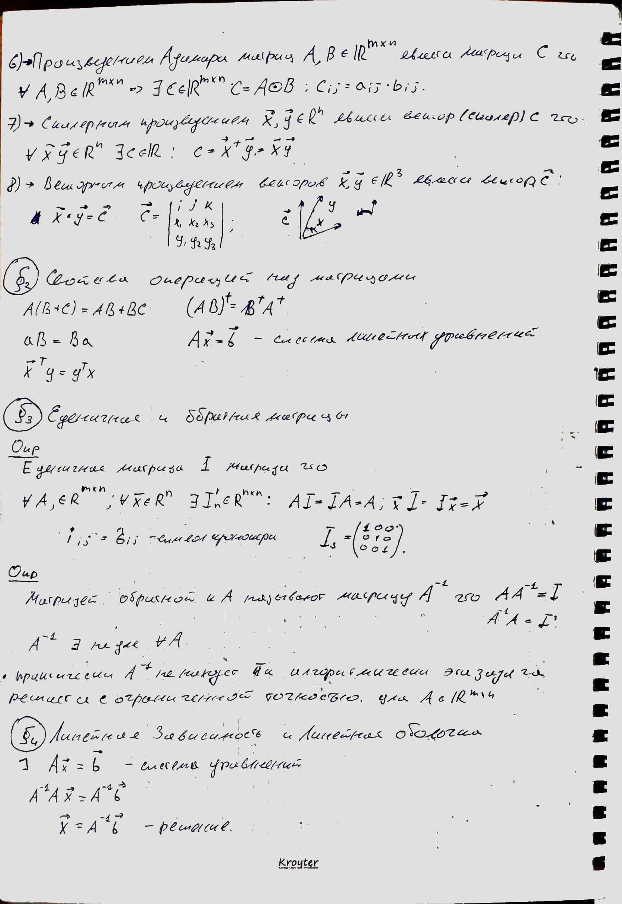
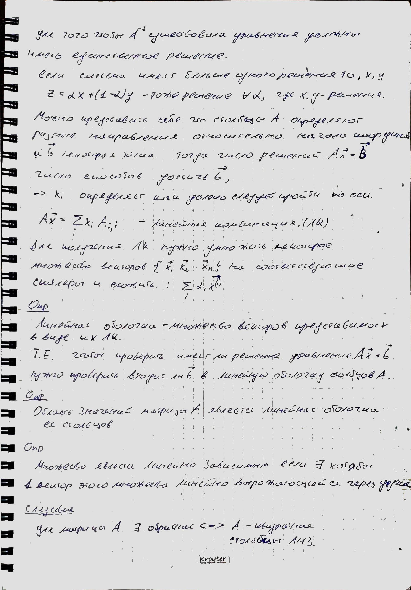

# Лекция 1

*В данной лекции в первой главе говорится об истории ML, об основных трендах. Во второй главе речь идет о линейной алгербе и о ее базовых понятиях.*

### Дополнительный материал

- Deep Learning Book (на русском). Стр. 57-60 - Метод главных компонент (будет рассмотрен в следующих лекциях).

## Список литературы

- Deep Learning Book (на русском). Стр. 1-57.
- Скрыдлова Е. В. Линейная алгебра части 1, 2.