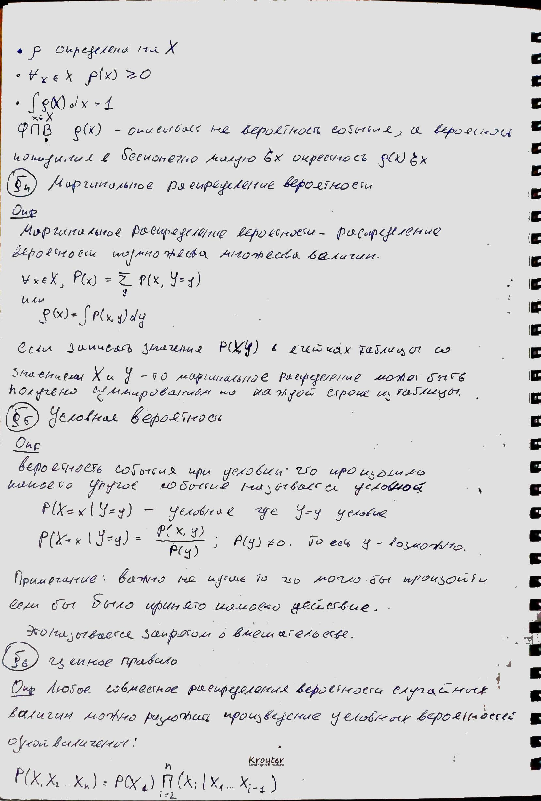

# Лекция 2

*В данной лекции в первой главе говорится о теории информации и теории вероятности.*

### Дополнительный материал

- GMM  (https://craftappmobile.com/1073-2/)
- EM algoritm (http://www.machinelearning.ru/wiki/index.php?title=EM_%D0%B0%D0%BB%D0%B3%D0%BE%D1%80%D0%B8%D1%82%D0%BC_%28%D0%BF%D1%80%D0%B8%D0%BC%D0%B5%D1%80%29)
- GMM Видео (англ) (https://youtu.be/Rkl30Fr2S38)
- EM algoritm (англ) (http://www.cse.iitm.ac.in/~vplab/courses/DVP/PDF/gmm.pdf)

## Список литературы

- Deep Learning Book (на русском). Стр. 60-81.
- Кибзун А. И., Сиротин А. Н. Теория вероятностей и математическая статистика. Базовый курс. (http://zyurvas.narod.ru/knyhy2/Kibzun.pdf)